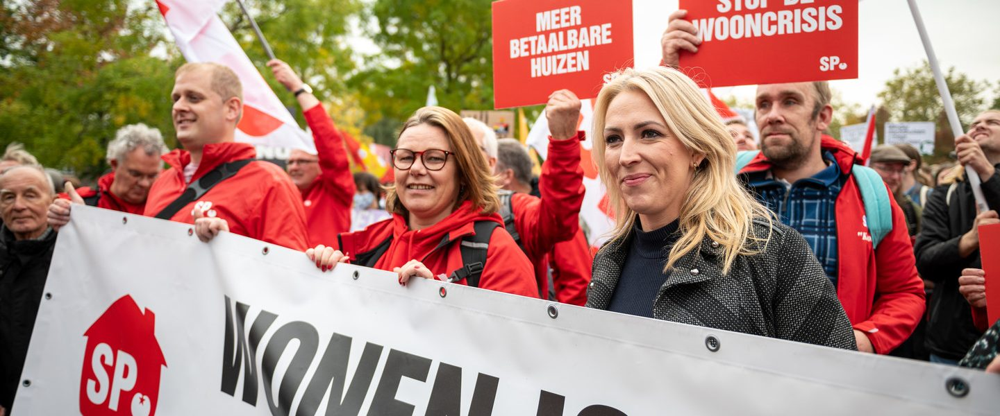
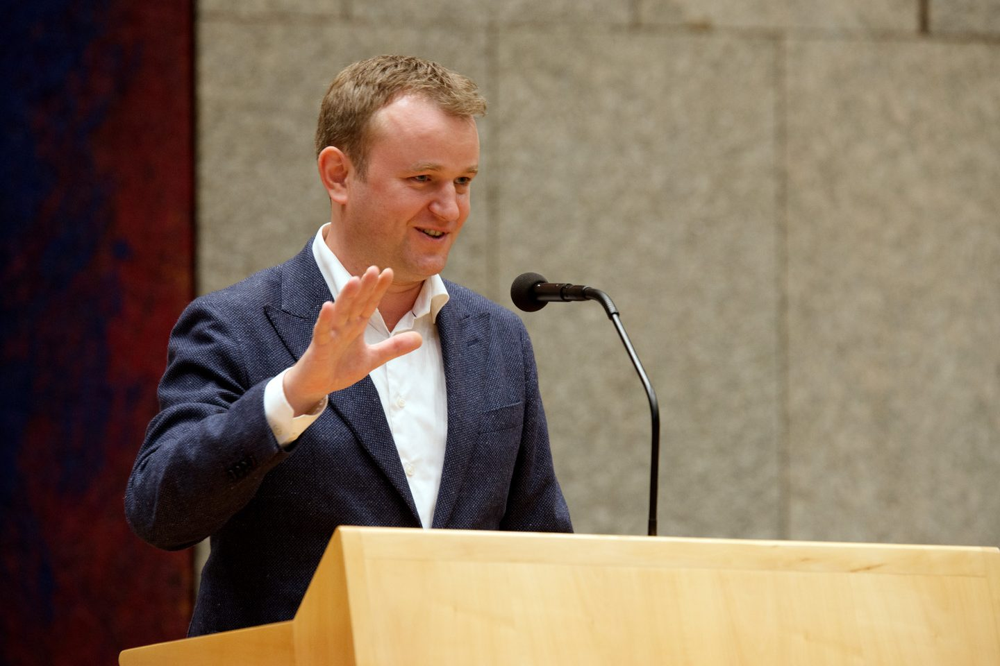
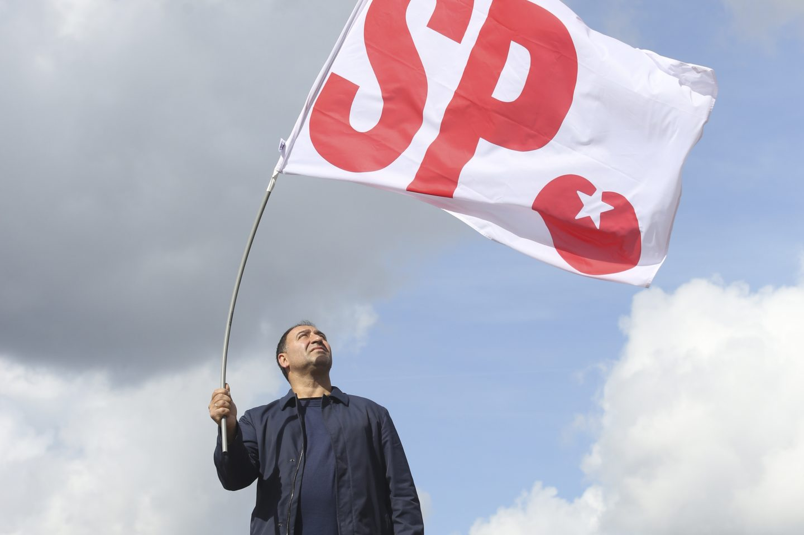

<!DOCTYPE html>
<html lang="en" dir="ltr">
  <head>
    <meta charset="utf-8">
    <link rel="stylesheet" href="style.css">
    <title>SP</title>
    <link rel="icon" href="sp logo.jpg">
  </head>
  <body>
     

    <table>
      <tr>
        <td><h1>Socialistische Partij</h1></td>
        <td>
        </td>
      </table>

  

<h1></h1>
<h2>
  <strong>WIJ STAAN VOOR </strong>
</h2>
 
<table id="customers">
  <tr>
    <th><h2>MENSELIJKE WAARDIGHEID, GELIJKWAARDIGHEID EN SOLIDARITEIT</h2>
We spannen ons in voor een betrokken, open en vrije samenleving waarin solidariteit voorop staat.Vooruitgang begint bij het bestrijden van achterstand.We kiezen voor schone energie en een gezond milieu voor mens en dier.</th>
    <th><h2>SAMENLEVEN, OP MENSELIJKE MAAT</h2>
We knokken voor betaalbare woningen, beter onderhoud en goede voorzieningen. Woningcorporaties zijn eigendom van de huurders. Ze zijn georganiseerd op buurtniveau, en werken samen ten behoeve van nieuwbouw, renovatie en onderhoud.
</th>
<tr>
   <td><h2>GROEI EN WELVAART EERLIJK VERDELEN</h2>
<strong>We willen armoede uitbannen en tweedeling bestrijden. We staan voor eerlijk werk voor een fatsoenlijk salaris. Ook ondersteunen we het midden- en kleinbedrijf. Het minimumloon wordt verhoogd, zodat er geen werkende armen meer zijn. Wie werkloos of arbeidsongeschikt wordt krijgt de steun die nodig is.</strong></td>
   <td><h2>GOEDE ZORG, HULP EN KANSEN VOOR WIE DAT NODIG HEEFT</h2>
<strong>We laten niemand achter. Goede zorg is persoonlijk, kleinschalig en voor iedereen beschikbaar. De zorg is geen markt. De SP wil het eigen risico afschaffen en een Nationaal ZorgFonds invoeren.</strong></td>
</tr>
<tr>
   <td><h2>TOEGANKELIJK ONDERWIJS VOOR IEDEREEN</h2>
<strong>Een school is geen toetsfabriek. We werken aan kleinere klassen en gemengde scholen. We gaan extra investeren in het onderwijs. En zorgen dat het beschikbare geld ook terecht komt in de klas.</strong></td>
   <td><h2>INTERNATIONALE SOLIDARITEIT</h2>
<strong>Een betere wereldwijde verdeling van de welvaart bevordert de kansen op geluk voor iedereen. Het Nederlandse buitenlandse beleid moet gericht zijn op samenwerking tot wederzijds voordeel en op bescherming en versterking van de mensenrechten. We staan voor Europese samenwerking tussen landen; een ondemocratische Europese Superstaat wijzen we af.</strong></td>
  </tr>
  </table>
<h1></h1>
  <h2><strong>ONZE MENSEN</strong></h2>
 
 
<table>
<tr>
<p1>
     
     <h3> <a href="https://www.sp.nl/onze-mensen/gekozen"> GEKOZEN</a></h3>
</p1>
 
<p2>
    
    <h3> <a href="https://www.sp.nl/onze-mensen/lokaal">VRIJWILLIGERS & BEKENDE GEZICHTEN</a> </h3>
</p2>
</table>
 
<h1></h1>

    <table>
      <tr>
        <td><h1> <a href="https://www.sp.nl/contact">CONTACT</a></h1></td>
        </td>
      </table>

</body>
</html>
